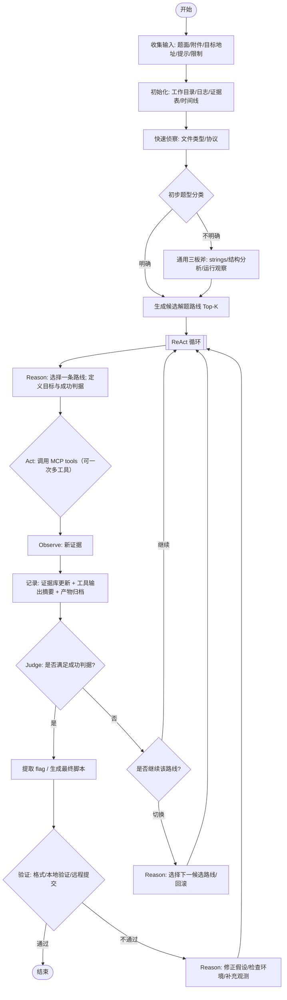

# CTF Agent（BUUCTF）ReAct 工作流设计

> 方法：采用 ReAct（Reason + Act + Observe）循环，将“推理 / 行动 / 观察”与工具调用、证据记录、分支决策结合。

---

## 1. 角色与核心概念

- **ReAct 循环**：
  - **Reason**：基于当前证据做假设与计划（可在内部进行，输出给用户的是可执行的下一步）。
  - **Act**：选择工具并执行动作（如下载附件、解码、运行脚本、抓包、符号执行等）。
  - **Observe**：读取输出与新证据，更新状态并决定是否继续循环。

- **状态（State）**：
  - 题目信息：名称/类别/描述/附件/靶机地址/限制
  - 证据库：文件哈希、关键字符串、IO 样例、运行日志、截图/抓包摘要
  - 假设集：当前最可能的题型与突破口
  - 计划栈：待执行步骤（可回滚）
  - 解题产物：脚本、payload、推导过程、flag 验证方式

- **工具（MCP 对接）抽象**：
  - 设计边界：**Agent 只负责“对接与编排”**，不负责任何 MCP Server 的具体实现与部署。
  - Agent 侧只需要 4 件事（参考 `utils/tools.py` 的思路）：
    1. **注册/加载**：从配置加载 MCP servers，并把它们暴露的 tools 统一注册成可调用的 `function_config` 列表（给模型做 tool-choice）。
    2. **发现/检索**：当 tools 很多时，对 tool 描述做检索（如 embedding/RAG）以缩小候选集合。
    3. **调用**：把模型输出的 `tool_calls`（支持一次多工具）解析出来 → 转发给对应 MCP tool → 收集原始输出。
    4. **汇总**：把多个 tool 输出做摘要（保留路径/端点/关键数据/漏洞线索），写入证据库，进入下一轮 ReAct。
  - 输出约束（Agent 侧统一格式化）：
    - 最少包含：`tool_name`、`arguments`、`raw_output`、`summary`、`artifacts`（文件/路径/哈希等）。

## 2. 详细工作流（可落地的 ReAct 子流程）

该流程强调：**每一步都要有“可观测的输出”**，并将输出写入证据库，避免无效探索。

---

## 3. 关键决策点（Agent 的“脑回路”约束）

1. **每轮循环只做一件可验证的小事**：例如“确认文件格式”“验证某段密钥是否正确”“确定栈溢出偏移”。
2. **观测必须结构化**：输出写入证据库（如 JSON/Markdown），包含：输入、命令、输出摘要、结论。
3. **分支切换要有理由**：比如连续 $N$ 次观测无增量信息、或成功判据与证据矛盾。
4. **优先选择低成本信息增益动作**：先静态、再动态；先定位关键校验点，再做重型爆破。

---
